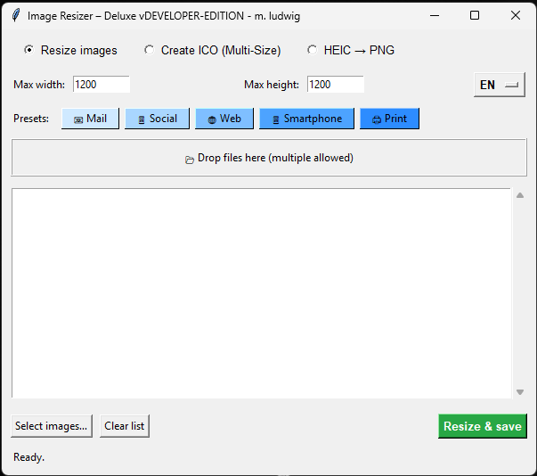

# Image Resizer Deluxe

We just needed a small and simple Image-Resizer in our company. So here it is ....

Simple and fast Image Shrinker with Drag'n'Drop and multi-selection.

6 Languages (DE, EN, RU, ES, FR, IT)

INFO: creates a config.json in same directory from where the tool has been run.

\# Image Resizer Deluxe 🖼️✨

Wir brauchten auf die Schnelle einen kleinen und unkomplizierten Bild-Verkleinerer. Hier ist er ....

Ein kleines, schnelles Desktop-Tool zum \*\*Verkleinern von Bildern\*\* – mit

\*\*Drag \& Drop\*\*, \*\*Presets\*\*, \*\*Tooltips\*\* und einer \*\*einfachen GUI\*\* auf Basis von Python \& Tkinter.

6 Sprachen (DE, EN, RU, ES, FR, IT)

INFO: Es wird eine config.json im Startverzeichnis des Programms angelegt.

\# GitHub

---

\## ✨ Features

\- 📂 \*\*Drag \& Drop\*\* (mehrere Dateien gleichzeitig)

\- 🖱️ Klassische \*\*Dateiauswahl\*\* als Fallback

\- 🎯 \*\*Preset-Buttons\*\* (Web, Mail, Social, Druck)

\- ℹ️ Tooltips mit Erklärung zu jedem Preset

\- 🎨 Presets in \*\*abgestuften Blautönen\*\* + Hover-Effekt

\- 📏 Manuelle Eingabe von Maximal-Breite/-Höhe

\- 📋 Liste aller ausgewählten Dateien

\- 🧹 „Liste leeren“-Button

\- 📁 Ausgabe in Unterordner `resized/`

\- 🧠 \*\*Dependency-Check beim Start\*\* (inkl. Nachfrage \& Auto-Install)

---

\##✅ Unterstützte Dateitypen (Stand jetzt)

JPEG → .jpg, .jpeg

PNG → .png

WebP → .webp

---

\## 🖥️ Screenshot (optional)

---

\## 📦 Voraussetzungen

\- \*\*Python 3.9 oder neuer\*\*

\- Tkinter (ist bei den meisten Python-Installationen bereits enthalten)

\- Internetverbindung beim ersten Start (für automatische Dependency-Installation)

---

\## 🚀 Installation \& Start

python Resizer.py

---

\## 🔧 Abhängigkeiten

\- Pillow – Bildverarbeitung

\- tkinterdnd2 – Drag \& Drop

Manuelle Installation (falls nötig):

pip install Pillow tkinterdnd2

---

\## 🧠 Nutzung

Preset auswählen oder gewünschte Maximalgröße eingeben

Bilder per Drag \& Drop hineinziehen

oder über „Bilder auswählen…“

Auf „Verkleinern \& speichern“ klicken

Fertig 🎉

→ Bilder liegen im Ordner resized/

Das Seitenverhältnis bleibt immer erhalten.

---

\## 📁 Ausgabe

Die verkleinerten Bilder werden im Unterordner

resized/ (neben den Originalbildern) gespeichert

Dateinamen bleiben unverändert

---

E N G L I S H

Image Resizer Deluxe
Simple and fast image shrinker with drag-and-drop and multi-selection

Image Resizer Deluxe 🖼️✨

A small, fast desktop tool for resizing images – featuring

drag & drop, presets, tooltips, and a simple GUI built with Python & Tkinter.

✨ Features

📂 Drag & Drop (multiple files at once)

🖱️ Classic file selection as a fallback

🎯 Preset buttons (Web, Mail, Social, Print)

ℹ️ Tooltips explaining each preset

🎨 Presets in graduated shades of blue with hover effect

📏 Manual input for maximum width/height

📋 List of all selected files

🧹 “Clear list” button

📁 Output in a resized/ subfolder

🧠 Dependency check on startup (with prompt & auto-install)

---

✅ Supported File Types (current)

JPEG → .jpg, .jpeg

PNG → .png

WebP → .webp

---

🖥️ Screenshot (optional)

(You can add a screenshot here later)

---

📦 Requirements

Python 3.9 or newer

Tkinter (included with most Python installations)

Internet connection on first start (for automatic dependency installation)

---

🚀 Installation & Start

python Resizer.py

---

🔧 Dependencies

Pillow – image processing

tkinterdnd2 – drag & drop support

- pip install Pillow tkinterdnd2 (for manual installation if required)

---

🧠 Usage

Select a preset or enter the desired maximum size

Drag images into the window

or use “Select images…”

Click “Resize & save”

Done 🎉

→ Images are saved in the resized/ folder

The aspect ratio is always preserved.

---

📁 Output

The resized images are saved in the subfolder

resized/ (next to the original images)

File names remain unchanged

2026 M. Ludwig

