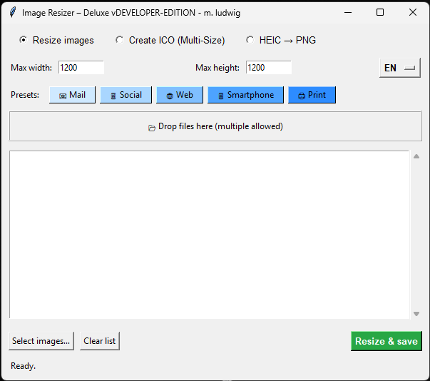

🖼️ IRDIC - Image Resizer Deluxe & ICO Converter
Ein schlankes, schnelles Desktop-Tool zum Verkleinern von Bildern und Erstellen von Windows-Icons, UPDATE: HEIC->PNG Konverter – entwickelt für den produktiven Einsatz im Büroalltag. Keine Cloud, kein Upload, alles lokal und sicher.

✨ Highlights
📂 Drag & Drop Support: Ziehe eine oder hunderte Dateien direkt ins Fenster.

🎯 Smart Presets: Vordefinierte Größen für Mail, Social Media, Web und Druck (inkl. hilfreicher Tooltips).

🛠️ 3-in-1 Tool: Umschaltbar zwischen Bild-Resizer und professionellem ICO-Konverter und NEU: Apple HEIC -> PNG Konverter

📦 Multi-Size ICOs: Erstellt Icons, die alle Windows-Standardgrößen enthalten (16px bis 256px) – für knackscharfe Icons in jeder Ansicht.

🌍 Mehrsprachig: Unterstützt 6 Sprachen (DE, EN, RU, ES, FR, IT).

🧠 Auto-Dependency Check: Installiert benötigte Bibliotheken (Pillow, tkinterdnd2) beim ersten Start automatisch.

📸 Screenshot

🚀 Installation & Nutzung
Voraussetzungen
Python 3.9+

Internetverbindung nur beim ersten Start (für den Auto-Installer).

Nutzung
Modus wählen: "Bilder verkleinern" oder "ICO erstellen".

Größe festlegen: Preset anklicken oder Werte manuell eingeben.

Bilder hinzufügen: Per Drag & Drop oder Dateiauswahl.

Start: Auf den grünen Button klicken – Fertig!

🛠 Technische Details
Unterstützte Formate
Input: .jpg, .jpeg, .png, .webp

Output (Resize): Gleiches Format wie Quelle, gespeichert im Unterordner /resized.

Output (ICO): Hochwertiges .ico Container-Format im Unterordner /icons.

Abhängigkeiten
Das Tool nutzt:

Pillow für die Bildverarbeitung.

tkinterdnd2 für die Drag & Drop Funktionalität.

📁 Konfiguration
Das Programm erstellt eine config.json im Startverzeichnis, um deine bevorzugte Sprache dauerhaft zu speichern.

📝 Lizenz & Autor
Entwickler: M. Ludwig

Jahr: 2026

🌍 English Summary
Image Resizer Deluxe is a lightweight desktop utility for fast image shrinking and ICO conversion. It features an intuitive drag-and-drop interface, multiple language support, and a smart dependency installer. The new ICO mode generates multi-layer icons compatible with all Windows view settings.